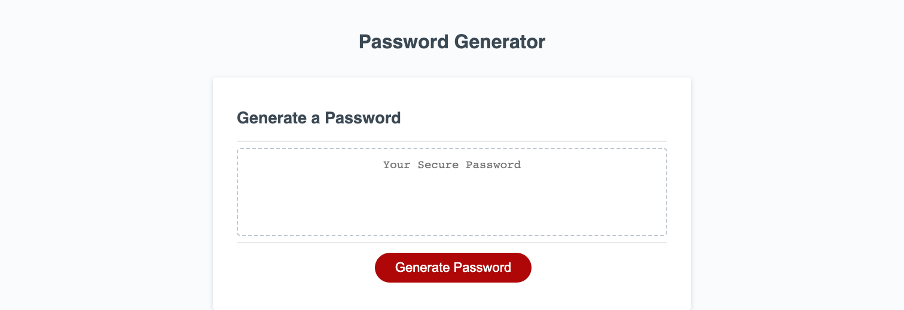

# Password-Generator

## Table of contents
* Description
* Resources
* Screenshot
* Deployed Project
* LICENSE

## Description 
Created an app that runs in the browser and features dynamically updated HTML and CSS, all powered by JavaScript codes. The app will have a clean and polished user interface that is responsive, ensuring that it adapts to multiple screen sizes.

## Resources:

* [JavaScript-MDN](https://developer.mozilla.org/en-US/docs/Web/JavaScript)

## Screenshot 

 

## Deployed Project

https://cimsgit.github.io/Password-Generator/ 
 

### License

[MIT LICENSE](./LICENSE)
